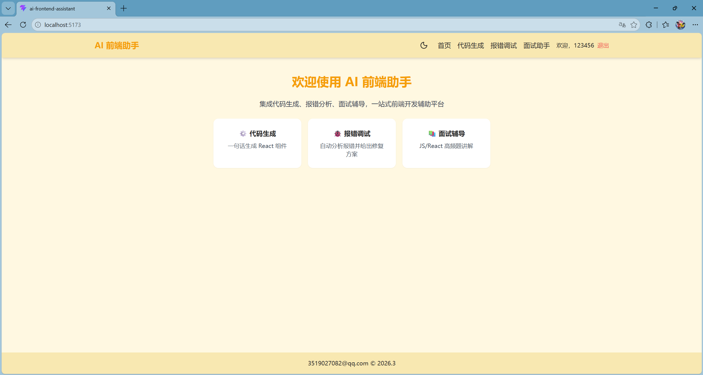
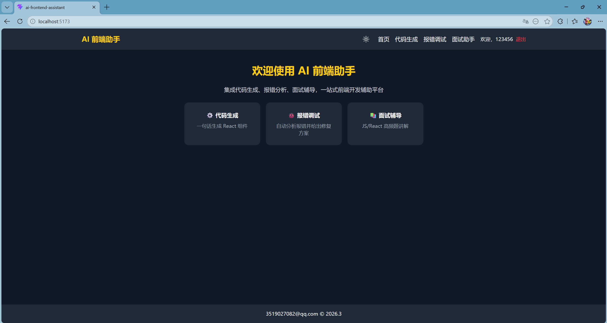
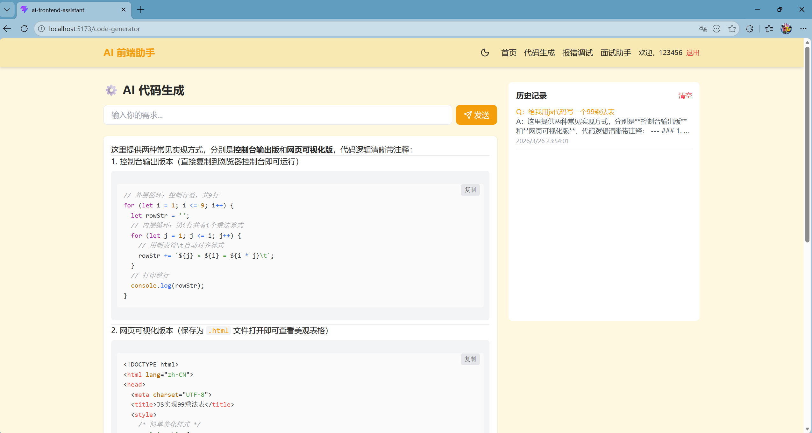
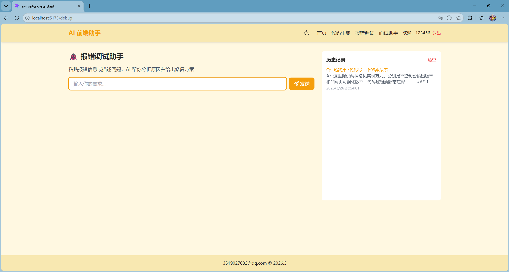
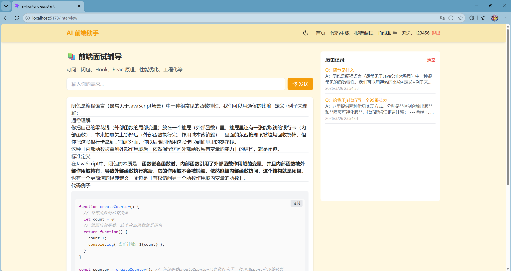
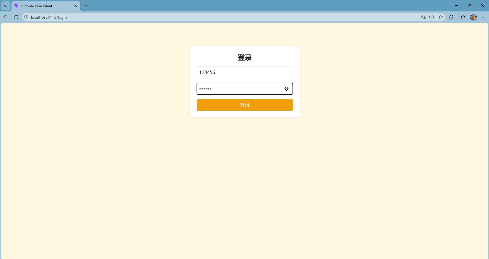

# 🚀 Ai-React-Ark - AI 前端开发助手
一款集 **代码生成、报错调试、面试辅助** 于一体的 AI 驱动前端工具，专为前端开发者打造，支持深浅色模式全局适配，助力开发效率与面试备考双重提升。

---

## ✨ 核心功能
| 功能模块 | 详细说明 |
| :--- | :--- |
| 🧠 **AI 代码生成** | 输入自然语言需求（如「写一个 React  TodoList 组件」），一键生成可直接运行的 React/HTML/CSS/JS 代码，支持代码实时编辑、语法补全、格式化 |
| 🐛 **报错调试助手** | 粘贴前端报错信息或描述问题场景，AI 自动分析报错原因、定位问题位置，给出分步修复方案与优化建议 |
| 📚 **前端面试辅导** | 生成前端高频面试题（覆盖 JS 基础、React/Vue 框架、性能优化等），提供详细解析与实战练习题，支持自定义考点筛选 |
| 🌓 **全局主题适配** | 深浅色模式自由切换，记忆用户偏好设置，适配不同光线环境与视觉习惯 |
| 📜 **历史记录管理** | 保存代码生成、报错调试、面试题查询历史，支持二次编辑与快速回溯 |

---

## 🛠️ 技术栈选型
| 分类 | 技术栈 |
| :--- | :--- |
| 前端核心 | React 18 + Vite 4 + JavaScript |
| 样式解决方案 | Tailwind CSS |
| 状态管理 | React Context |
| 后端服务 | Node.js + Express |
| AI 集成 | 豆包大模型 API |
| 其他 | 响应式设计、深浅色主题系统、Axios 网络请求 |

---

## 📝 项目结构
```
Ai-React-Ark
├── public
│   ├── favicon.ico
│   └── index.html
├── src
│   ├── assets
│   ├── components
│   ├── pages
│   ├── utils
│   ├── App.css
│   ├── App.js
│   ├── index.css
│   ├── index.js
│   └── main.js
├── .gitignore
├── package.json
└── README.md

---


## 🖥️ 项目界面展示（图片标注对应场景）
### 🏠 首页（功能入口）
> 标注：项目总入口，清晰展示三大核心功能模块，支持主题模式切换



### 🧩 AI 代码生成模块
> 标注：左侧输入自然语言需求，右侧实时生成代码，支持复制、编辑、重新生成


### 🐛 报错调试助手模块
> 标注：输入报错信息/问题描述，AI 输出问题分析、修复步骤、优化代码


### 📚 前端面试辅导模块
> 标注：展示面试题分类、题目列表、详细解析，支持收藏重点题目


### 📝 操作日志模块
> 标注：记录所有功能使用历史，支持按时间/功能类型筛选，便于回溯操作


---

## 🚀 快速开始
### 1. 环境要求
- Node.js ≥ 14.0.0
- npm ≥ 6.0.0 

### 2. 克隆项目
```bash
git clone https://github.com/Jack-Alex0526/Ai-React-Ark.git
cd Ai-React-Ark